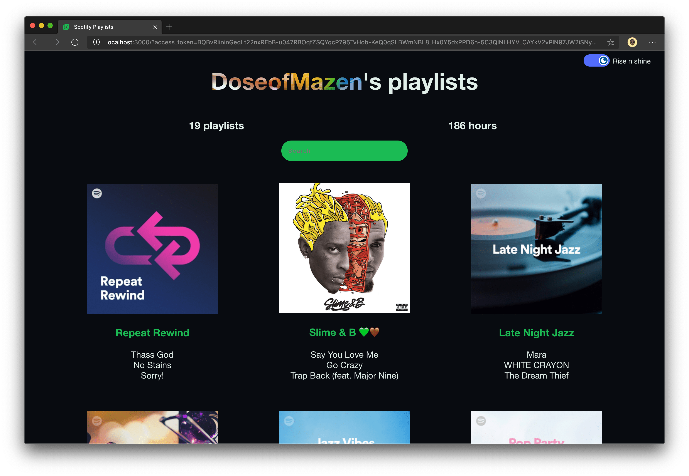

# Spotify-playlists



This app uses React to display a Spotify's user playlist. This app is dependent on [Spotify-playlists-backend](https://shrtm.nu/ILJC).

## Getting Started

To run this application locally have sure that you have the [NodeJs](https://nodejs.org) installed on your machine first (also as [Git](https://git-scm.com/downloads) optionally to help clone this repo), then follow the workflow to the initial setup:

1. Fork & clone this repository;

   ```terminal
       git clone git@github.com/<my-username>/Spotify-playlists my-api
   ```

2. Move inside to your cloned repo and then install the dependencies:

   ```terminal
       cd my-api && npm install
   ```

3. Start your application:

   ```terminal
       npm start
   ```

Runs the app in the development mode.<br />
Open [http://localhost:3000](http://localhost:3000) to view it in the browser.

The page will reload if you make edits.<br />
You will also see any lint errors in the console.

## Deploying to production

This is indented to be deployed on Heroku. After installing the heroku CLI tools you can run the below commands.

```terminal
heroku create my-frontend
git push heroku master
heroku open
```

## Learn More About React ⚛

You can learn more in the [Create React App documentation](https://facebook.github.io/create-react-app/docs/getting-started).
